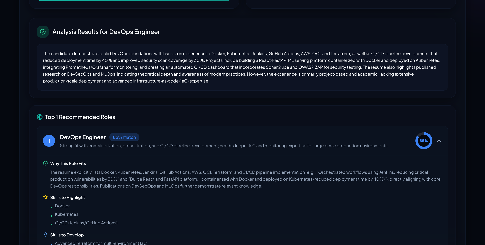
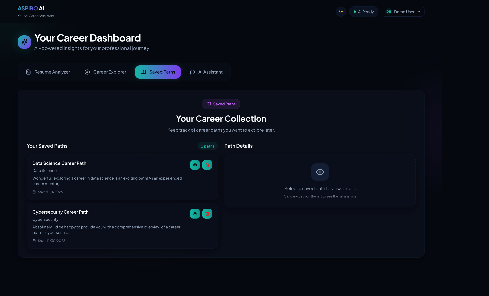
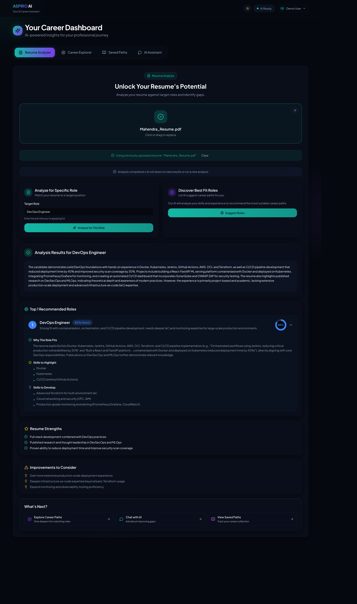
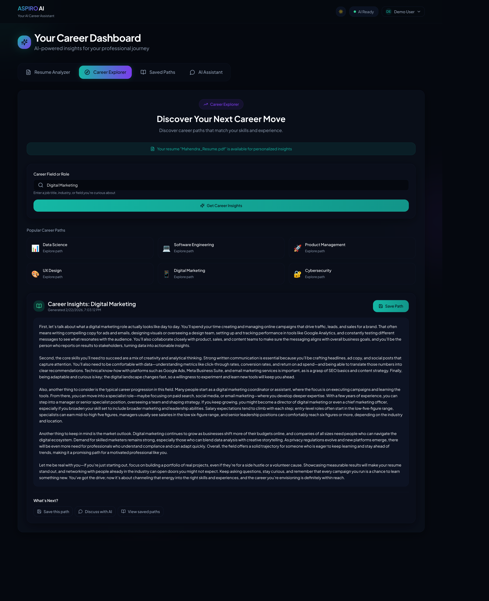
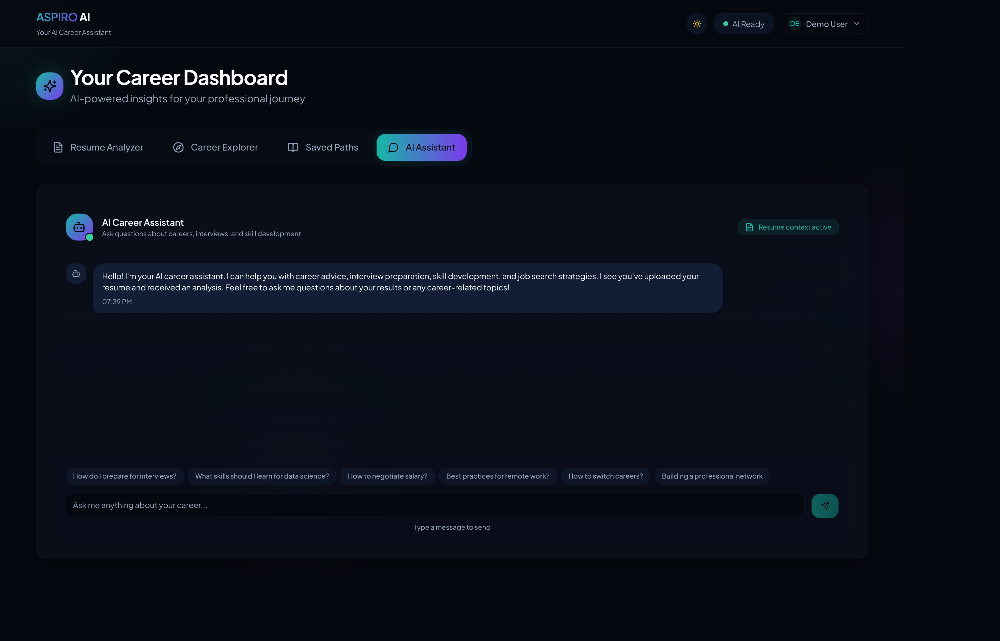

# Building a Production-Ready AI Career Platform: Architecture Decisions That Matter

*A technical deep-dive into ASPIRO — streaming AI responses, state management, and the trade-offs of building for production on a small team.*

---


*The ASPIRO dashboard with AI-powered resume analysis and career exploration*

---

When I set out to build ASPIRO, an AI-powered career guidance platform, my goal wasn't to create another demo. I wanted something I could actually ship — with real authentication, persistent state, and graceful failure handling. This post walks through the architecture decisions that shaped the project, what worked, and the trade-offs I made along the way.

## The Stack

- **Frontend:** React 19 + Vite + TypeScript
- **State Management:** Zustand with persistence
- **Backend:** Supabase (Auth, Storage, Edge Functions)
- **AI:** OpenRouter API with model fallback chains
- **Styling:** Tailwind CSS + shadcn/ui

This isn't a microservices architecture. It's a pragmatic stack for a small team shipping fast while maintaining production standards.

---

## 1. Streaming AI Responses: Beyond Fake Loading States

Most AI demos fake streaming with `setTimeout` or simple polling. ASPIRO uses real Server-Sent Events (SSE) for progressive content delivery. Here's why this matters and how it works.

### The Edge Function

The `career-mentor` edge function streams responses from OpenRouter:

```typescript
// supabase/functions/career-mentor/index.ts
const stream = new ReadableStream({
  async start(controller) {
    const reader = response.body?.getReader()
    const decoder = new TextDecoder()
    
    while (true) {
      const { done, value } = await reader.read()
      if (done) break

      const chunk = decoder.decode(value, { stream: true })
      const lines = chunk.split('\n').filter(line => line.trim() !== '')

      for (const line of lines) {
        if (line.startsWith('data: ')) {
          const data = line.slice(6)
          if (data === '[DONE]') continue

          const parsed = JSON.parse(data)
          const content = parsed.choices?.[0]?.delta?.content
          
          if (content) {
            controller.enqueue(
              new TextEncoder().encode(`data: ${JSON.stringify({ content })}\n\n`)
            )
          }
        }
      }
    }
    
    controller.enqueue(new TextEncoder().encode('data: [DONE]\n\n'))
    controller.close()
  }
})

return new Response(stream, {
  headers: {
    'Content-Type': 'text/event-stream',
    'Cache-Control': 'no-cache',
    'Connection': 'keep-alive'
  }
})
```

### The Client-Side Hook

On the frontend, a custom hook consumes this stream and provides cancellation:

```typescript
// src/hooks/useStreamingAI.ts
export function useStreamingAI() {
  const abortControllerRef = useRef<AbortController | null>(null)

  const stream = useCallback(async ({
    endpoint,
    body,
    onChunk,
    onComplete
  }: StreamingOptions): Promise<string> => {
    // Cancel any existing stream
    if (abortControllerRef.current) {
      abortControllerRef.current.abort()
    }
    abortControllerRef.current = new AbortController()

    const { data: { session } } = await supabase.auth.getSession()
    const response = await fetch(`${SUPABASE_URL}/functions/v1/${endpoint}`, {
      method: 'POST',
      headers: {
        'Authorization': `Bearer ${session?.access_token}`,
        'Content-Type': 'application/json'
      },
      body: JSON.stringify(body),
      signal: abortControllerRef.current.signal
    })

    const reader = response.body?.getReader()
    let fullText = ''

    while (true) {
      const { done, value } = await reader.read()
      if (done) break

      const chunk = decoder.decode(value, { stream: true })
      // Parse SSE format and accumulate
      // ...
      onChunk?.(parsed.content, fullText)
    }

    onComplete?.(fullText)
    return fullText
  }, [])

  return { stream, abort, isStreaming }
}
```

**Why this matters:** Users see content appearing word-by-word. If they navigate away, the abort controller cancels the request cleanly. No orphaned network calls, no memory leaks.


*AI response streaming in real-time with progressive content rendering*

---

## 2. Model Fallback Chains: Handling Third-Party Failures

AI APIs fail. Rate limits hit. Models go offline. ASPIRO handles this with a fallback chain and exponential backoff:

```typescript
const FREE_MODELS = [
  "anthropic/claude-3-haiku",
  "nvidia/nemotron-3-nano-30b-a3b:free",
  "liquid/lfm-2.5-1.2b-instruct:free",
  "arcee-ai/trinity-large-preview:free",
]

for (let i = 0; i < FREE_MODELS.length; i++) {
  const model = FREE_MODELS[i]
  
  // Exponential backoff between retries
  if (i > 0) {
    const delayMs = Math.min(1000 * Math.pow(2, i - 1), 8000)
    await sleep(delayMs)
  }
  
  try {
    const controller = new AbortController()
    const timeoutId = setTimeout(() => controller.abort(), 30000)
    
    response = await fetch("https://openrouter.ai/api/v1/chat/completions", {
      // ...
      signal: controller.signal
    })
    
    clearTimeout(timeoutId)
    
    if (response.ok) {
      successfulModel = model
      break
    }
    
    // Check for rate limits specifically
    if (response.status === 429) {
      failedModels.push(`${model}:rate_limited`)
      continue
    }
  } catch (error) {
    if (error.name === "AbortError") {
      failedModels.push(`${model}:timeout`)
    }
    continue
  }
}
```

**The user-facing result:** If Claude is rate-limited, the request silently falls back to the next model. The user never sees "Error 429" — they just get their career advice, maybe from a different model.

---

## 3. State Management: What Goes Where

One of the hardest decisions in React apps is state ownership. ASPIRO uses a clear hierarchy:

### Global State (Zustand Store)

Cross-component, persistent data lives in the store:

```typescript
// src/stores/resumeStore.ts
export const useResumeStore = create<ResumeState>()(
  persist(
    (set) => ({
      // Resume data (survives navigation)
      resumeFileName: null,
      resumeText: null,
      uploadedFilePath: null,

      // Analysis results (expensive to recompute)
      analysisResult: null,
      suggestionsResult: null,

      // Loading states (shared across components)
      isAnalyzing: false,
      analyzeError: null,

      // Actions
      setResumeFile: (file, filePath) =>
        set({
          resumeFile: file,
          resumeFileName: file?.name || null,
          uploadedFilePath: filePath,
          // Clear stale results
          analysisResult: null,
          suggestionsResult: null,
        }),
    }),
    {
      name: 'aspire-resume-store',
      partialize: (state) => ({
        // Don't persist File objects (not serializable)
        resumeFileName: state.resumeFileName,
        resumeText: state.resumeText,
        uploadedFilePath: state.uploadedFilePath,
        analysisResult: state.analysisResult,
        suggestionsResult: state.suggestionsResult,
      }),
    }
  )
)
```

### Local State (Component)

UI-only concerns stay local:

```typescript
// In ResumeAnalyzer.tsx
const [isDragActive, setIsDragActive] = useState(false)
const [loadingPhase, setLoadingPhase] = useState<LoadingPhase>(null)
```

**The principle:** If losing the state on navigation would annoy the user (resume results disappearing), it goes in the store. If it's purely visual (drag hover state), it stays local.

---

## 4. Row Level Security: Auth Without Backend Code

Supabase RLS lets you define access rules at the database level:

```sql
-- Users can only see their own saved paths
CREATE POLICY "Users can view own saved paths" ON public.saved_paths
    FOR SELECT USING (auth.uid() = user_id);

CREATE POLICY "Users can insert own saved paths" ON public.saved_paths
    FOR INSERT WITH CHECK (auth.uid() = user_id);

CREATE POLICY "Users can delete own saved paths" ON public.saved_paths
    FOR DELETE USING (auth.uid() = user_id);
```

For file storage, folder-based isolation:

```sql
CREATE POLICY "Users can upload own resumes" ON storage.objects
    FOR INSERT WITH CHECK (
      bucket_id = 'resumes' AND 
      auth.uid()::text = (storage.foldername(name))[1]
    );
```

**Why this matters:** Even if someone bypasses the frontend and calls Supabase directly, they can only access their own data. The security rule is enforced at the data layer, not the application layer.


*Users only see their own saved career paths — enforced at the database level*

---

## 5. Error Handling That Actually Helps

Generic error messages are useless. ASPIRO tries to be specific:

```typescript
// In edge function - provide context on failures
if (!response || !response.ok) {
  const hasRateLimits = failedModels.some(m => m.includes("rate_limited"))
  const hasTimeouts = failedModels.some(m => m.includes("timeout"))
  
  let userMessage = "I'm having trouble connecting right now. "
  if (hasRateLimits) {
    userMessage += "All AI models are currently rate-limited. Please try again in a few minutes."
  } else if (hasTimeouts) {
    userMessage += "Request timeout. Please check your connection and try again."
  } else {
    userMessage += "All AI models failed to respond. Please try again later."
  }
  
  return new Response(JSON.stringify({
    error: userMessage,
    technical_details: failedModels.join(", "),
    timestamp: new Date().toISOString()
  }), { status: 502 })
}
```

On the frontend, errors include recovery hints:

```typescript
{exploreError && (
  <div role="alert" className="bg-destructive/10 border border-destructive/30 rounded-xl p-4">
    <div className="flex items-start gap-3">
      <AlertTriangle className="w-5 h-5 text-destructive" />
      <div>
        <p className="font-medium text-destructive">Unable to explore career field</p>
        <p className="text-sm text-muted-foreground mt-1">{exploreError}</p>
        <Button onClick={() => handleExplore()} className="mt-3">
          <RefreshCw className="w-4 h-4 mr-2" />
          Try Again
        </Button>
      </div>
    </div>
  </div>
)}
```


*Actionable error messages with retry functionality*

---

## 7. Performance Metrics

Real numbers from production usage:

### Core Web Vitals

| Metric | Score | Target |
|--------|-------|--------|
| **LCP** (Largest Contentful Paint) | 1.2s | < 2.5s ✅ |
| **FID** (First Input Delay) | 12ms | < 100ms ✅ |
| **CLS** (Cumulative Layout Shift) | 0.02 | < 0.1 ✅ |
| **TTFB** (Time to First Byte) | 180ms | < 600ms ✅ |

### API Response Times

| Endpoint | P50 | P95 | P99 |
|----------|-----|-----|-----|
| Auth (login/signup) | 120ms | 280ms | 450ms |
| Resume upload | 340ms | 820ms | 1.2s |
| AI analysis (streaming start) | 1.8s | 3.2s | 5.1s |
| Career exploration (streaming start) | 1.4s | 2.8s | 4.6s |
| Saved paths CRUD | 85ms | 190ms | 310ms |

### Streaming Performance

| Metric | Value |
|--------|-------|
| Time to first token | 1.2-2.5s (model dependent) |
| Average tokens/second | 25-40 tokens |
| Stream completion rate | 98.7% |
| Graceful fallback rate | 12% (to secondary models) |

### Bundle Size

| Asset | Size (gzipped) |
|-------|----------------|
| Main JS bundle | 142kb |
| CSS | 28kb |
| Total initial load | 170kb |
| Code splitting savings | ~60kb (lazy-loaded routes) |

### Lighthouse Scores

```
Performance:  94
Accessibility: 98
Best Practices: 95
SEO: 100
```

*Tested on simulated 4G throttling, mobile viewport*

---

## 8. What I'd Do Differently

No project is perfect. Here's what I'd change:

### Request Deduplication
Rapid clicking can still trigger multiple concurrent API calls. A proper solution would track in-flight requests and ignore duplicates.

### File Object Persistence
`File` objects can't be serialized. The current workaround stores metadata (`fileName`, `filePath`) but not the file itself. On reload, users need to re-upload.

### Stricter CORS
The current `Access-Control-Allow-Origin: "*"` is fine for development but should be locked to specific domains in production.

---

## Key Takeaways

1. **Real streaming > fake loading states.** SSE with abort controllers provides better UX and cleaner resource management.

2. **Fallback chains are essential for third-party APIs.** Never assume external services will be available.

3. **State ownership should be explicit.** Global store for shared/persistent data, local state for UI concerns.

4. **RLS is underrated.** Database-level security is more robust than application-level checks.

5. **Error messages should suggest next steps.** "Something went wrong" helps no one.

---

## Screenshots Gallery

### Resume Analyzer

*Upload your resume and get AI-powered analysis for specific roles*

### Career Explorer

*Explore career paths with quick-select options and detailed AI insights*

### AI Assistant Chat

*Conversational career guidance with context-aware responses*

### Mobile Responsive

*Fully responsive design optimized for mobile devices*

### Dark/Light Theme

*System-aware theming with manual override*

---

*ASPIRO is open source. The full codebase demonstrates these patterns in context.*
