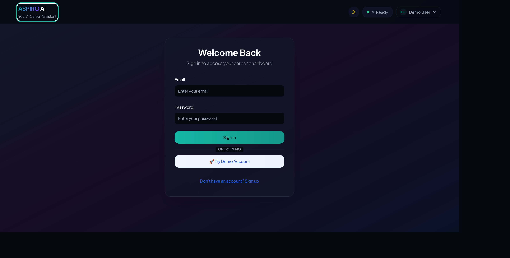

<p align="center">
  
</p>

<h1 align="center">ASPIRO — AI Career Pathfinder</h1>

<p align="center">
  <strong>AI-powered career guidance platform that analyzes resumes, explores career paths, and provides personalized mentoring through real-time streaming.</strong>
</p>

<p align="center">
  
  
  
  
  
  
</p>

---

## Overview

ASPIRO is a full-stack AI career guidance platform built for real-world usage — not a demo. It features authenticated user sessions, persistent state, real-time SSE streaming from AI models, and production-grade error handling with automatic model failover.

Users upload their resume (PDF/TXT), receive AI-powered analysis against target roles, explore career fields with conversational AI insights, and save paths for later reference — all within a polished, accessible dashboard.

---

## Screenshots

### Dashboard & Resume Analysis
> Upload a resume and get AI-driven analysis with match percentages, skill gaps, and actionable recommendations.


### Career Explorer
> Explore any career field and receive comprehensive, streaming AI insights on responsibilities, skills, salary, and market outlook.


### AI Career Assistant
> Context-aware chat — the AI knows your resume and analysis results, providing personalized career advice.


### Saved Career Paths
> Save and revisit career explorations. Persistent across sessions via Supabase.


### Authentication
> Secure email/password auth with Supabase. Includes demo account for quick access.



---

## Architecture

```
┌──────────────────────────────────────────────────────┐
│                    Frontend (Vite + React)            │
│  ┌──────────┐  ┌───────────┐  ┌───────────────────┐ │
│  │ Zustand   │  │ useStream │  │ React Components  │ │
│  │ Store     │◄─┤ ingAI     │◄─┤ (Dashboard, Chat) │ │
│  │ (persist) │  │ (SSE)     │  │                   │ │
│  └─────┬─────┘  └─────┬─────┘  └───────────────────┘ │
│        │              │                               │
└────────┼──────────────┼───────────────────────────────┘
         │              │  HTTPS + Bearer JWT
         ▼              ▼
┌──────────────────────────────────────────────────────┐
│              Supabase (Backend-as-a-Service)          │
│  ┌──────────┐  ┌───────────────┐  ┌──────────────┐  │
│  │ Auth      │  │ Edge Functions │  │ Storage      │  │
│  │ (JWT)     │  │ (Deno)        │  │ (Resumes)    │  │
│  └──────────┘  │ • analyze-    │  └──────────────┘  │
│                │   resume       │                     │
│  ┌──────────┐  │ • career-     │  ┌──────────────┐  │
│  │ Postgres  │  │   mentor      │  │ Row Level    │  │
│  │ (profiles,│  └───────┬───────┘  │ Security     │  │
│  │  paths)   │          │          └──────────────┘  │
│  └──────────┘          │                             │
└─────────────────────────┼─────────────────────────────┘
                          │  SSE Streaming
                          ▼
              ┌───────────────────────┐
              │  OpenRouter API       │
              │  Model Fallback Chain │
              │  ├─ Claude 3 Haiku    │
              │  ├─ Nemotron Nano     │
              │  ├─ LFM 2.5           │
              │  ├─ Trinity Large     │
              │  └─ Solar Pro 3       │
              └───────────────────────┘
```

---

## Tech Stack

| Layer | Technology | Purpose |
|-------|-----------|---------|
| **Frontend** | React 18 + TypeScript | UI with strict typing |
| **Build** | Vite 5.4 | Fast HMR, optimized production builds |
| **State** | Zustand 5 (persisted) | Global state with localStorage persistence |
| **Styling** | Tailwind CSS + shadcn/ui | Utility-first CSS with accessible components |
| **Auth** | Supabase Auth | JWT-based email/password authentication |
| **Database** | Supabase PostgreSQL | Profiles, saved career paths (RLS enforced) |
| **Storage** | Supabase Storage | Resume file uploads (user-scoped buckets) |
| **AI** | Supabase Edge Functions → OpenRouter | SSE streaming with 5-model failover chain |
| **PDF Parsing** | unpdf (via edge function) | Server-side PDF text extraction |

---

## Features

### Core
- **Resume Analysis** — Upload PDF/TXT, get AI analysis against any target role with match %, skill gaps, and strengths
- **Role Suggestions** — AI recommends best-fit roles based on resume content with detailed explanations
- **Career Explorer** — Explore any career field with comprehensive streaming AI insights
- **AI Career Assistant** — Context-aware chat that references your resume and analysis results
- **Saved Paths** — Bookmark career explorations to revisit later

### Production Quality
- **Real SSE Streaming** — Word-by-word AI responses via Server-Sent Events (not fake loading)
- **Model Failover** — 5-model cascade with exponential backoff; if one model is rate-limited, the next picks up
- **Partial JSON Parsing** — Renders analysis results progressively even from truncated streams
- **Auth-Gated Access** — JWT verification on all edge functions; RLS on all database tables
- **Persistent State** — Resume data and analysis results survive page refresh via Zustand persistence
- **Accessible UI** — ARIA roles, keyboard navigation, screen reader support, skip-to-content link
- **Error Recovery** — Contextual error messages with retry actions; no silent failures

---

## Getting Started

### Prerequisites

- **Node.js** ≥ 18
- **Supabase** account (free tier works)
- **OpenRouter** API key

### 1. Clone & Install

```bash
git clone https://github.com/TechTyphoon/aspire-ai-pathfinder-pro.git
cd aspire-ai-pathfinder-pro
npm install
```

### 2. Environment Variables

```bash
cp .env.example .env
```

Edit `.env` with your Supabase project credentials:

```env
VITE_SUPABASE_PROJECT_ID="your-project-id"
VITE_SUPABASE_PUBLISHABLE_KEY="your-supabase-anon-key"
VITE_SUPABASE_URL="https://your-project-id.supabase.co"
```

### 3. Supabase Setup

1. Create a new Supabase project
2. Run the migration in `supabase/migrations/001_initial_schema.sql` via the SQL editor
3. Set the following **Edge Function secrets** in Supabase Dashboard → Settings → Edge Functions:
   - `OPENROUTER_API_KEY` — your OpenRouter API key
   - `OPENROUTER_API_KEY_BACKUP` (optional) — backup key for failover
4. Deploy edge functions:

```bash
supabase functions deploy analyze-resume
supabase functions deploy career-mentor
```

### 4. Run Locally

```bash
npm run dev
```

The app will be available at `http://localhost:8080`.

### 5. Build for Production

```bash
npm run build
npm run preview
```

---

## Project Structure

```
├── src/
│   ├── components/
│   │   ├── auth/              # Login, SignUp, ProtectedRoute
│   │   ├── dashboard/         # Dashboard, ResumeAnalyzer, CareerExplorer,
│   │   │                      # SavedPaths, AIAssistantChat
│   │   ├── resume/            # AnalysisResult, UploadZone, AnalysisProgress
│   │   ├── layout/            # Header
│   │   └── ui/                # shadcn/ui components
│   ├── hooks/
│   │   ├── useResumeAnalysis.ts   # Resume analysis orchestration + JSON parsing
│   │   └── useStreamingAI.ts      # SSE streaming hook with abort support
│   ├── stores/
│   │   └── resumeStore.ts         # Zustand persisted store
│   ├── contexts/
│   │   └── AuthContext.tsx         # Supabase auth context
│   └── pages/                     # Route pages
├── supabase/
│   ├── functions/
│   │   ├── analyze-resume/        # Resume analysis edge function
│   │   └── career-mentor/         # Career chat edge function
│   ├── migrations/                # Database schema
│   └── config.toml                # Supabase project config
├── docs/screenshots/              # App screenshots
└── scripts/
    └── keep-alive.sh              # Supabase free-tier anti-pause script
```

---

## Database Schema

```sql
-- User profiles (auto-created on signup)
profiles (id UUID PK → auth.users, email TEXT, created_at TIMESTAMPTZ)

-- Saved career explorations
saved_paths (id BIGSERIAL PK, user_id UUID FK → auth.users, 
             path_name TEXT, path_details_json JSONB, created_at TIMESTAMPTZ)

-- Row Level Security: users can only access their own data
-- Storage: resume files scoped to user_id folders
```

---

## Key Engineering Decisions

| Decision | Rationale |
|----------|-----------|
| **Zustand over Redux** | Minimal boilerplate, built-in persistence middleware, excellent TypeScript support |
| **SSE over WebSockets** | Unidirectional streaming is sufficient; SSE works through CDNs and proxies without upgrade negotiation |
| **Edge Functions over REST** | Colocated with Supabase infra, auto-scaled, no server to manage |
| **Model Fallback Chain** | Free-tier models get rate-limited; cascading through 5 models ensures reliable responses |
| **Partial JSON Parsing** | Streaming returns incomplete JSON; custom regex parser renders results progressively |
| **Persisted localStorage State** | Resume + analysis survive page refresh; users don't re-upload on accidental navigation |

---

## License

This project is for educational and portfolio purposes.

---

<p align="center">
  Built by <a href="https://github.com/TechTyphoon">Mahendra Reddy</a>
</p>
